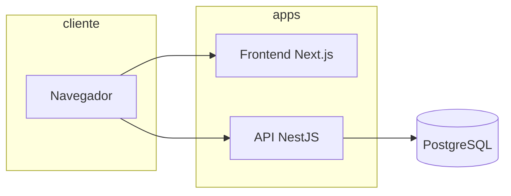
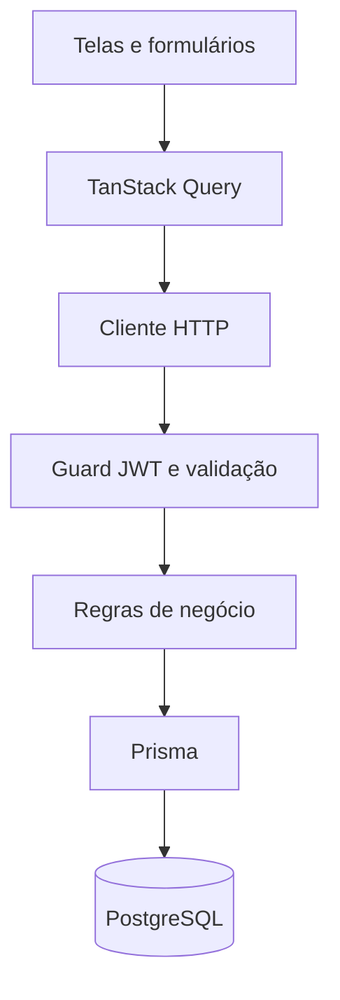
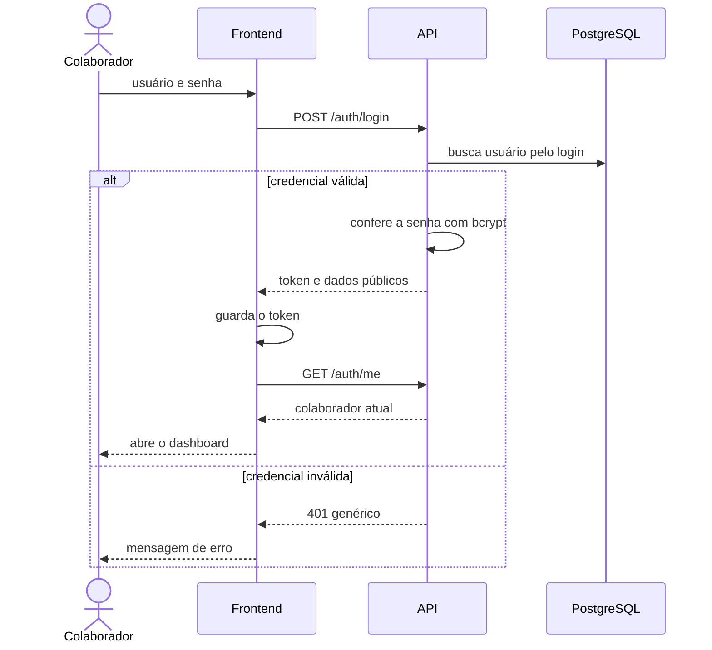
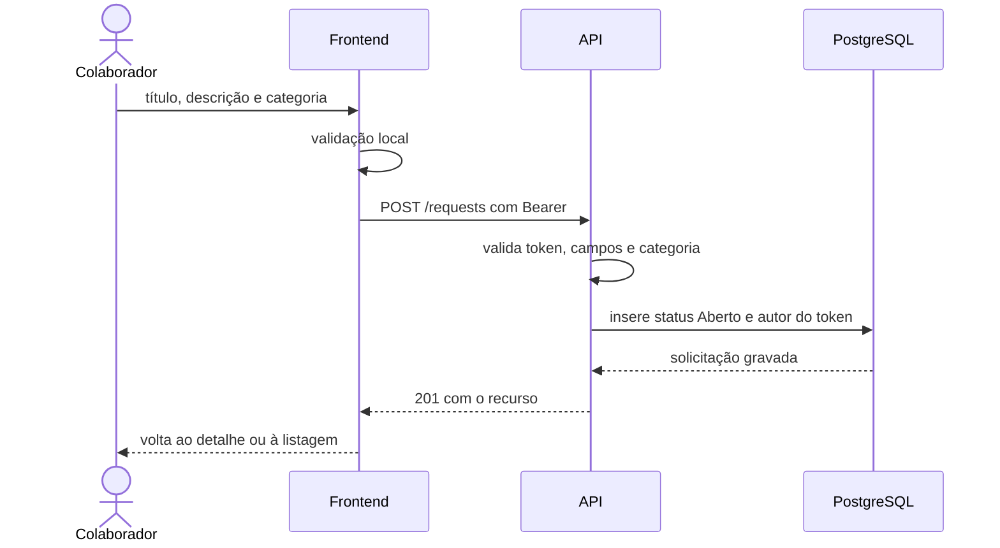
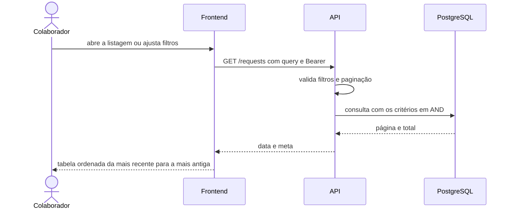
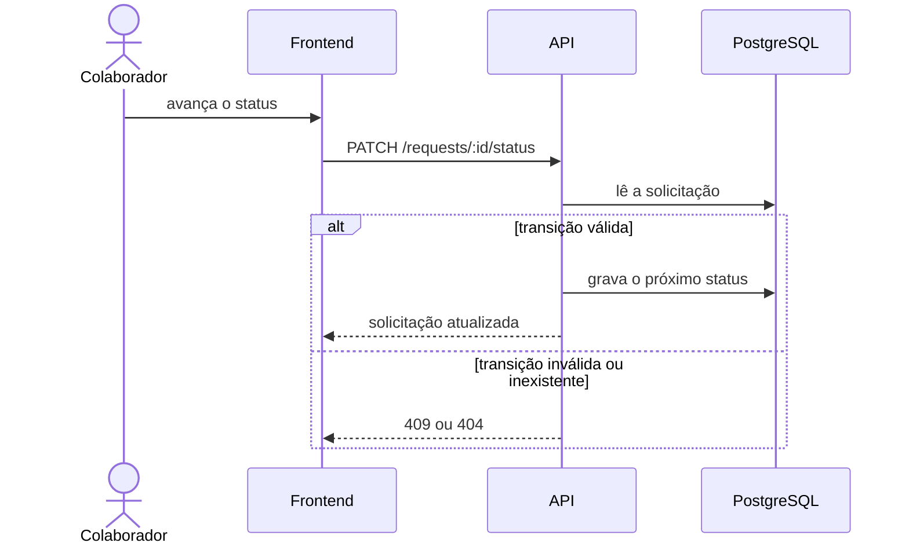

# Arquitetura — Portal de Solicitações Internas

Fase 1: arquitetura alvo. Nenhum componente desta estrutura deve ser implementado nesta etapa.

## 1. Visão geral

A aplicação tem três partes de execução: interface web, API REST e PostgreSQL. O navegador fala somente com o frontend e com a API. A API é o único componente que acessa o banco.



O frontend é um cliente da API. Não há regras de autorização exclusivas da interface e não há rotas de backend dentro do Next.js. Docker Compose sobe a infraestrutura local, com o banco como serviço obrigatório.

## 2. Responsabilidades

### Frontend

- Renderizar login, dashboard, listagem, formulário e detalhe.
- Validar formulários antes do envio, para resposta imediata ao usuário.
- Montar filtros e exibir listagens.
- Guardar o token da sessão e enviá-lo no cabeçalho `Authorization`.
- Impedir navegação às telas internas sem token.
- Traduzir códigos de categoria e status para os rótulos em português.
- Exibir mensagens de erro devolvidas pela API.

O frontend não define autor, data de criação, status inicial nem se uma edição, exclusão ou transição é permitida.

### Backend

- Autenticar usuário e senha e emitir o token.
- Exigir token válido em toda rota protegida.
- Validar entrada e aplicar as regras de `regras-de-negocio.md`.
- Persistir e consultar dados exclusivamente pelo Prisma.
- Autorizar edição e exclusão pelo autor e pelo status.
- Calcular o dashboard no banco.
- Devolver erros no formato de `api.md`, sem vazar detalhe interno.

### Banco

- Persistir usuários e solicitações.
- Impedir dados órfãos, categorias inválidas, status inválidos e usuário duplicado.
- Manter timestamps de criação e atualização.

O banco não autentica o colaborador e não conhece o token. A autorização fica na API, que usa a identidade extraída do token e o estado gravado da solicitação.

## 3. Comunicação entre as camadas

- Protocolo: HTTP JSON, UTF-8.
- Estilo: REST, recursos nomeados em inglês, mensagens de erro em português.
- Datas de resposta: ISO-8601 em UTC.
- Autenticação das rotas protegidas: `Authorization: Bearer <token>`.
- Origem do frontend permitida por CORS restrito à URL configurada. Não se usa curinga em conjunto com credenciais.
- O navegador chama a API diretamente. Não existe BFF.



## 4. Organização do monorepo

Gerenciador: pnpm. Orquestração de tarefas: Turborepo.

```text
estudo-bit/
├── apps/
│   ├── api/                 # NestJS
│   └── web/                 # Next.js
├── packages/
│   └── shared/              # enums e tipos de categoria e status
├── docs/
├── docker-compose.yml
├── package.json
├── pnpm-workspace.yaml
└── turbo.json
```

`packages/shared` carrega apenas os valores estáveis de categoria e status, e os rótulos de exibição se forem úteis aos dois lados. Não contém regra de transição, autorização nem acesso a banco. Cada aplicação continua responsável pela sua validação: Zod no frontend e class-validator no backend.

Módulos previstos na API, quando a implementação começar:

| Módulo | Responsabilidade |
| --- | --- |
| auth | Login, leitura do usuário atual e contrato de logout. |
| requests | CRUD de conteúdo, listagem filtrada e mudança de status. |
| dashboard | Contagens globais. |
| prisma | Cliente e acesso ao PostgreSQL. |

Não há módulo de gestão de usuários além da leitura do autenticado. Não há cadastro público.

Portas locais previstas:

| Serviço | Porta |
| --- | --- |
| Frontend | 3000 |
| API | 3001 |
| PostgreSQL | 5432 |

Variáveis previstas, sem valores reais nesta fase: `DATABASE_URL`, `JWT_SECRET`, `JWT_EXPIRES_IN`, `CORS_ORIGIN`, `NEXT_PUBLIC_API_URL`.

## 5. Fluxo de autenticação

O controle de sessão desta entrega é um JWT de acesso com expiração de 8 horas. Não há refresh token nem lista de revogação. Logout descarta o token no cliente. Até expirar, um token já emitido continua válido se for apresentado à API. Essa limitação está assumida em `decisoes-tecnicas.md`.

O frontend guarda o token em `sessionStorage`. Ao fechar a aba, a sessão local some. Cada requisição protegida envia o cabeçalho Bearer. Cookie `HttpOnly`, `Secure` e `SameSite` fica registrado como melhoria futura e não entra nesta entrega.



Proteção de tela no frontend:

1. Sem token, as rotas internas redirecionam para o login.
2. Com token, o login redireciona para o dashboard.
3. Resposta 401 em chamada autenticada limpa o token e volta ao login.

Essa proteção é conveniência. A API repete a verificação em toda rota protegida.

Logout:

1. O frontend chama `POST /auth/logout` se ainda houver token.
2. Remove o token local mesmo se essa chamada falhar.
3. Leva o colaborador ao login.

## 6. Fluxo de criação de solicitação



O corpo não aceita solicitante, data nem status. Se esses campos forem enviados, a API os rejeita.

## 7. Fluxo de consulta e listagem



A consulta de detalhe é `GET /requests/:id`. O identificador inexistente retorna 404. Qualquer colaborador autenticado pode ler qualquer solicitação.

Filtros vazios significam "sem restrição nesse critério". Período usa `created_at`. O texto pesquisa somente o título e trata `%` e `_` como caracteres literais.

## 8. Fluxo de alteração de status



Ações de conteúdo usam outros métodos e outras regras:

| Ação | Chamada | Quem | Condição |
| --- | --- | --- | --- |
| Editar conteúdo | `PATCH /requests/:id` | somente o autor | status Aberto |
| Excluir | `DELETE /requests/:id` | somente o autor | status Aberto |
| Avançar status | `PATCH /requests/:id/status` | qualquer autenticado | próxima etapa do ciclo |

A interface esconde edição e exclusão quando a condição não se aplica, e só oferece a próxima transição válida. Se o estado mudou no servidor entre a renderização e o clique, a API recusa e a tela mostra o erro.

## 9. Dashboard

`GET /dashboard` executa contagens no PostgreSQL. A API não carrega todas as solicitações para contar em memória. O frontend exibe os quatro números e pode levar o colaborador à listagem filtrada por status.

## 10. Tratamento de erros na arquitetura

- Validação de entrada falha antes da regra de negócio.
- Regra de estado e transição falha com o código definido em `api.md`.
- Falha inesperada vira resposta genérica 500, com o detalhe técnico apenas no log do servidor.
- Prisma é o caminho de acesso ao SQL, o que evita concatenar consulta com entrada do usuário.

## 11. Execução local prevista

Na fase de implementação, Docker Compose deve permitir subir o PostgreSQL e, de forma composta, a API e o frontend. O desenvolvimento diário pode rodar API e frontend com pnpm, desde que o banco esteja disponível e as migrations apliquem a estrutura descrita em `modelo-de-dados.md`.

Não há deploy em nuvem, pipeline de CI nem ambiente além do uso local desta entrega.
