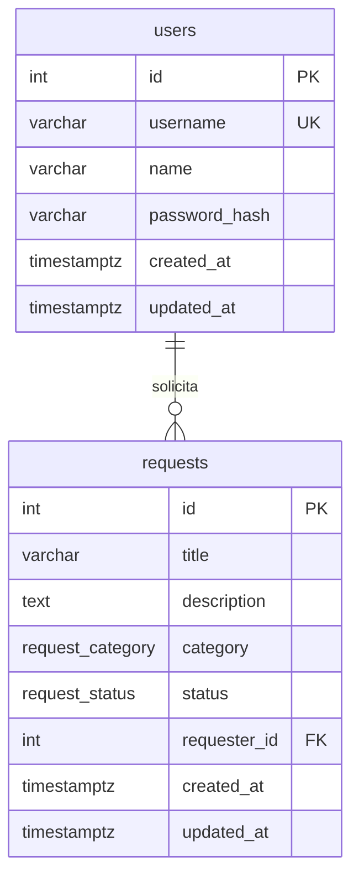

# Modelo de dados — Portal de Solicitações Internas

Fase 1: modelo lógico e físico previsto. Não inclui schema Prisma nem migration.

O banco é PostgreSQL. A estrutura será criada depois por migrations do Prisma. Os nomes físicos abaixo são os nomes das tabelas e colunas no banco.

## 1. Visão do modelo

Existem duas entidades: usuário e solicitação. Um usuário registra zero ou muitas solicitações. Toda solicitação tem exatamente um solicitante.

Não há tabelas de perfil, comentário, anexo, histórico ou sessão. O token JWT não é persistido.

## 2. Enumerações

### request_category

| Valor | Rótulo |
| --- | --- |
| `TI` | TI |
| `RH` | RH |
| `COMPRAS` | Compras |
| `FINANCEIRO` | Financeiro |
| `INFRAESTRUTURA` | Infraestrutura |

### request_status

| Valor | Rótulo |
| --- | --- |
| `ABERTO` | Aberto |
| `EM_ATENDIMENTO` | Em Atendimento |
| `CONCLUIDO` | Concluído |

Os enums vivem no PostgreSQL. A aplicação não grava categoria ou status como texto livre.

## 3. Dicionário de dados

### users

Colaborador que acessa o portal. Não há cadastro por tela.

| Coluna | Tipo | Nulo | Descrição |
| --- | --- | --- | --- |
| `id` | `integer` | não | Chave primária. Sequência gerada pelo banco. Identificador interno do colaborador. |
| `username` | `varchar(50)` | não | Login único, armazenado em minúsculas. |
| `name` | `varchar(120)` | não | Nome exibido na coluna Solicitante e no perfil. |
| `password_hash` | `varchar(255)` | não | Hash bcrypt da senha. Nunca retornado pela API. |
| `created_at` | `timestamptz` | não | Momento de inserção do usuário, em UTC. |
| `updated_at` | `timestamptz` | não | Momento da última atualização do usuário, em UTC. |

Constraints:

- Chave primária: `id`.
- Único: `username`.
- Verificação: `username` entre 3 e 50 caracteres e no padrão `^[a-z0-9._]+$`.
- Verificação: `name` entre 2 e 120 caracteres, após a regra de aplicação.
- Verificação: `password_hash` não vazio.

### requests

Solicitação interna.

| Coluna | Tipo | Nulo | Descrição |
| --- | --- | --- | --- |
| `id` | `integer` | não | Chave primária e código exibido na listagem. Sequência gerada pelo banco. |
| `title` | `varchar(120)` | não | Título informado pelo solicitante. |
| `description` | `text` | não | Descrição informada pelo solicitante. |
| `category` | `request_category` | não | Uma das cinco categorias. |
| `status` | `request_status` | não | Situação atual. Valor inicial `ABERTO`. |
| `requester_id` | `integer` | não | Chave estrangeira para `users.id`. Autor da solicitação. |
| `created_at` | `timestamptz` | não | Data de abertura, definida pelo servidor. Base do filtro de período. |
| `updated_at` | `timestamptz` | não | Última alteração de conteúdo ou de status. |

Constraints:

- Chave primária: `id`.
- Chave estrangeira: `requester_id` referencia `users.id`.
- `ON DELETE RESTRICT`: o banco impede apagar um usuário que ainda tenha solicitação.
- `ON UPDATE CASCADE`: atualização do `id` do usuário acompanha a chave. A aplicação não atualiza esse `id`.
- Verificação: comprimento de `title` entre 3 e 120.
- Verificação: comprimento de `description` entre 10 e 2000.
- Valor padrão de `status`: `ABERTO`.
- Valores padrão de `created_at` e `updated_at`: instante atual do banco.

Não há coluna de data de conclusão. O fim do ciclo é o status `CONCLUIDO`. Não há coluna de exclusão lógica.

## 4. Relacionamentos

| Origem | Destino | Cardinalidade | Coluna |
| --- | --- | --- | --- |
| `requests` | `users` | N para 1 | `requests.requester_id` |

Uma solicitação não existe sem solicitante. Um usuário pode não ter solicitações.

## 5. Índices

| Índice | Colunas | Motivo |
| --- | --- | --- |
| Único de login | `users.username` | Login e garantia de usuário único. |
| Por solicitante | `requests.requester_id` | Integridade da chave estrangeira e apoio à checagem de autoria. |
| Por status | `requests.status` | Filtro de status e contagens do dashboard. |
| Por categoria | `requests.category` | Filtro de categoria. |
| Por abertura | `requests.created_at` | Ordenação e filtro de período. |

A busca por trecho no título usa comparação textual sem distinção de maiúsculas e minúsculas. Neste volume de projeto técnico não se cria índice de trigrama. Se a lista crescer além do uso esperado do processo seletivo, esse índice pode ser reavaliado sem mudar o contrato.

## 6. Integridade que o banco garante

- Não há solicitação com categoria ou status fora dos enums.
- Não há solicitação sem título, descrição, categoria, status ou solicitante.
- Não há dois usuários com o mesmo login.
- Não há solicitante apontando para usuário inexistente.
- Título e descrição respeitam os tamanhos também no banco, não só na validação da API.
- O status inicial padrão é `ABERTO` se a aplicação não enviar outro valor. A API, ainda assim, grava `ABERTO` de forma explícita na criação.

Regras que permanecem na API, porque dependem do usuário autenticado ou da transição:

- só o autor edita ou exclui;
- edição e exclusão apenas em `ABERTO`;
- sequência de status;
- filtros e formato de erro.

## 7. Decisões de modelagem

### Duas tabelas

Usuário e solicitação cobrem o enunciado. Categoria e status como enum evitam tabelas de domínio para cinco e três valores fixos. Uma tabela auxiliar só se justificaria se alguém fosse cadastrar categorias pela tela, o que não existe.

### Identificador inteiro como código

`requests.id` é ao mesmo tempo chave primária e código da listagem. É simples de ler, de filtrar e de mostrar. UUID não foi escolhido porque o requisito exibe um código humano e não há integração externa que exija identificador opaco.

### Nome separado do login

O login pode ser curto e técnico. A coluna Solicitante usa `users.name`, que é estável e não exige perfil editável.

### Sem data de conclusão e sem histórico

Guardar cada mudança de status exigiria outra tabela e uma funcionalidade de auditoria que está fora do escopo. `updated_at` registra a última escrita. Ele não significa, sozinho, a data em que a solicitação foi concluída, porque uma edição de conteúdo aberto também o atualiza. Como não há requisito de exibir data de conclusão, essa coluna não será criada.

### Sem sessão no banco

O JWT não é gravado. Isso combina com a decisão de não revogar token no servidor.

### Exclusão física

Não há `deleted_at`. A exclusão permitida pela regra remove a linha. As contagens do dashboard passam a ignorá-la naturalmente.

### Timestamps com fuso

`timestamptz` armazena o instante em UTC. O filtro por dia de calendário converte as datas `YYYY-MM-DD` para o início e o fim daquele dia em UTC, como definido nas regras de negócio.

### Usuários iniciais

A implementação futura deve incluir uma carga de desenvolvimento com pelo menos dois colaboradores, para demonstrar autoria: um cria a solicitação e o outro tenta editar, excluir e avançar o status. Credenciais de desenvolvimento não fazem parte deste modelo e não devem ser tratadas como senha de produção.

### O que não entra no modelo

Perfil, permissão, comentário, anexo, responsável designado, prioridade, notificação, refresh token e trilha de auditoria. Os motivos estão em `decisoes-tecnicas.md`.
