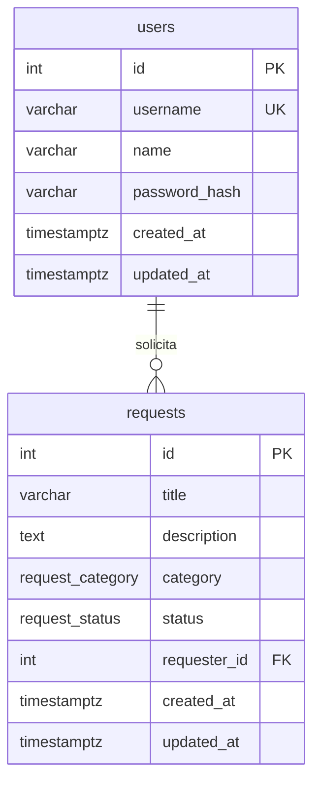

# Modelo de dados — Portal de Solicitações Internas

O banco é PostgreSQL. A estrutura está em `apps/api/prisma/schema.prisma` e na migration `apps/api/prisma/migrations/20260929183530_init_users_and_requests`. Os nomes abaixo são os nomes físicos das tabelas e colunas.

## 1. Visão do modelo

Existem duas entidades: usuário e solicitação. Um usuário registra zero ou muitas solicitações. Toda solicitação tem exatamente um solicitante.

Não há tabelas de perfil, comentário, anexo, histórico ou sessão. O token JWT não é persistido.

## 2. Enumerações

### request_category

| Valor | Rótulo |
| --- | --- |
| `TI` | TI |
| `RH` | RH |
| `COMPRAS` | Compras |
| `FINANCEIRO` | Financeiro |
| `INFRAESTRUTURA` | Infraestrutura |

### request_status

| Valor | Rótulo |
| --- | --- |
| `ABERTO` | Aberto |
| `EM_ATENDIMENTO` | Em Atendimento |
| `CONCLUIDO` | Concluído |

Os enums vivem no PostgreSQL. A aplicação não grava categoria ou status como texto livre.

## 3. Dicionário de dados

### users

Colaborador que acessa o portal. Não há cadastro por tela. As contas de demonstração vêm do seed.

| Coluna | Tipo | Nulo | Descrição |
| --- | --- | --- | --- |
| `id` | `integer` | não | Chave primária. Sequência gerada pelo banco. Identificador interno do colaborador. |
| `username` | `varchar(50)` | não | Login único. O seed grava em minúsculas e o login compara depois de normalizar. |
| `name` | `varchar(120)` | não | Nome exibido na coluna Solicitante e no perfil. |
| `password_hash` | `varchar(255)` | não | Hash bcrypt da senha. Nunca retornado pela API. |
| `created_at` | `timestamptz` | não | Momento de inserção do usuário. O banco usa `CURRENT_TIMESTAMP` quando o valor não é enviado. |
| `updated_at` | `timestamptz` | não | Momento da última atualização do usuário. A migration não define valor padrão. O Prisma preenche a coluna em cada escrita. |

### requests

Solicitação interna.

| Coluna | Tipo | Nulo | Descrição |
| --- | --- | --- | --- |
| `id` | `integer` | não | Chave primária e código exibido na listagem. Sequência gerada pelo banco. |
| `title` | `varchar(120)` | não | Título informado pelo solicitante. O tipo limita o tamanho máximo. |
| `description` | `text` | não | Descrição informada pelo solicitante. O tipo não limita o comprimento. |
| `category` | `request_category` | não | Uma das cinco categorias. |
| `status` | `request_status` | não | Situação atual. Valor padrão no banco: `ABERTO`. |
| `requester_id` | `integer` | não | Chave estrangeira para `users.id`. Autor da solicitação. |
| `created_at` | `timestamptz` | não | Data de abertura. O banco usa `CURRENT_TIMESTAMP` quando o valor não é enviado. Base do filtro de período. |
| `updated_at` | `timestamptz` | não | Última alteração de conteúdo ou de status. A migration não define valor padrão. O Prisma preenche a coluna em cada escrita. |

Não há coluna de data de conclusão. O fim do ciclo é o status `CONCLUIDO`. Não há coluna de exclusão lógica.

## 4. Relacionamentos

| Origem | Destino | Cardinalidade | Coluna |
| --- | --- | --- | --- |
| `requests` | `users` | N para 1 | `requests.requester_id` |

Uma solicitação não existe sem solicitante. Um usuário pode não ter solicitações.

## 5. Índices

| Índice | Colunas | Motivo |
| --- | --- | --- |
| Único de login | `users.username` | Login e garantia de usuário único. A comparação é sensível a maiúsculas. |
| Por solicitante | `requests.requester_id` | Integridade da chave estrangeira e apoio à checagem de autoria. |
| Por status | `requests.status` | Filtro de status e contagens do dashboard. |
| Por categoria | `requests.category` | Filtro de categoria. |
| Por abertura | `requests.created_at` | Ordenação e filtro de período. |

A busca por trecho no título usa comparação textual sem distinção de maiúsculas e minúsculas. Neste volume de projeto técnico não se cria índice de trigrama. Se a lista crescer além do uso esperado do processo seletivo, esse índice pode ser reavaliado sem mudar o contrato.

## 6. O que o PostgreSQL impõe

A migration cria estas restrições:

- Chave primária em `users.id` e `requests.id`, com sequência.
- `users.username` único, com no máximo 50 caracteres.
- `users.name` e `users.password_hash` obrigatórios, com no máximo 120 e 255 caracteres.
- `requests.title` obrigatório, com no máximo 120 caracteres.
- `requests.description` obrigatória, do tipo `text`, sem limite de comprimento no banco.
- `requests.category` e `requests.status` restritos aos enums.
- `requests.status` com padrão `ABERTO`.
- `requests.requester_id` obrigatório, referenciando `users.id`.
- `ON DELETE RESTRICT`: o banco impede apagar um usuário que ainda tenha solicitação.
- `ON UPDATE CASCADE`: atualização do `id` do usuário acompanha a chave. A aplicação não atualiza esse `id`.
- `created_at` obrigatório, com padrão `CURRENT_TIMESTAMP`, nas duas tabelas.
- `updated_at` obrigatório, sem padrão SQL, nas duas tabelas.
- Índices em `requester_id`, `status`, `category` e `created_at`.

A migration não cria `CHECK` para tamanho mínimo, formato de login ou tamanho da descrição.

## 7. O que a aplicação valida

Estas regras estão na API, nos DTOs e nos serviços. O frontend repete parte delas nos formulários. O banco não as impõe.

- Login: usuário obrigatório, de 3 a 50 caracteres, com espaços removidos e comparação em minúsculas. Senha obrigatória, de 8 a 72 caracteres.
- Não há validação de um padrão como letras, dígitos, ponto e sublinhado. A unicidade do login é a constraint do banco.
- Título, depois do trim: obrigatório, de 3 a 120 caracteres.
- Descrição, depois do trim: obrigatória, de 10 a 2000 caracteres.
- Categoria obrigatória e pertencente ao enum.
- Campo não previsto no corpo é recusado.
- Na criação, a API grava o solicitante autenticado, o status `ABERTO` e não aceita código, datas ou status enviados pelo cliente.
- Edição e exclusão: somente o autor, e somente com status `ABERTO`.
- Transição de status: qualquer autenticado, apenas `ABERTO` → `EM_ATENDIMENTO` → `CONCLUIDO`.
- Filtros, paginação e formato de erro.

Um `INSERT` direto no banco pode gravar descrição fora de 10 a 2000 caracteres, título com menos de 3 caracteres ou um hash vazio. A API do portal não faz isso.

## 8. Decisões de modelagem

### Duas tabelas

Usuário e solicitação cobrem o enunciado. Categoria e status como enum evitam tabelas de domínio para cinco e três valores fixos. Uma tabela auxiliar só se justificaria se alguém fosse cadastrar categorias pela tela, o que não existe.

### Identificador inteiro como código

`requests.id` é ao mesmo tempo chave primária e código da listagem. É simples de ler, de filtrar e de mostrar. UUID não foi escolhido porque o requisito exibe um código humano e não há integração externa que exija identificador opaco.

### Nome separado do login

O login pode ser curto e técnico. A coluna Solicitante usa `users.name`. A API do portal não edita esse nome.

### Sem data de conclusão e sem histórico

Guardar cada mudança de status exigiria outra tabela e uma funcionalidade de auditoria que está fora do escopo. `updated_at` registra a última escrita. Ele não significa, sozinho, a data em que a solicitação foi concluída, porque uma edição de conteúdo aberto também o atualiza. Não há coluna de data de conclusão.

### Sem sessão no banco

O JWT não é gravado. Isso combina com a decisão de não revogar token no servidor.

### Exclusão física

Não há `deleted_at`. A exclusão permitida pela regra remove a linha. As contagens do dashboard passam a ignorá-la naturalmente.

### Timestamps com fuso

`timestamptz` armazena o instante. O filtro por dia de calendário converte as datas `YYYY-MM-DD` para o início daquele dia em UTC e o início do dia seguinte, como definido nas regras de negócio.

### Usuários iniciais

O seed em `apps/api/prisma/seed.ts` cria três colaboradores de demonstração: Ana Souza, Bruno Lima e Carla Mendes. As credenciais estão no README e servem só ao ambiente local. O modelo não trata essas senhas como credencial de produção.

### O que não entra no modelo

Perfil, permissão, comentário, anexo, responsável designado, prioridade, notificação, refresh token e trilha de auditoria. Os motivos estão na análise crítica de `memorial-tecnico.md`.
